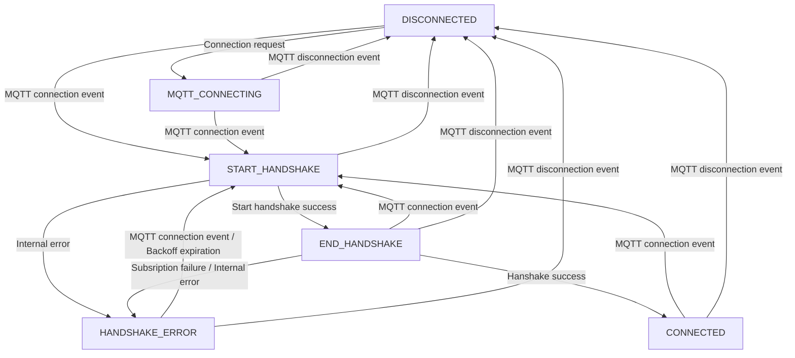

<!--
Copyright 2024 SECO Mind Srl

SPDX-License-Identifier: Apache-2.0
-->

# Astarte device architecture

A more in depth description of the architecture of the Astarte device is present in this section.

## Device connectivity state machine

The device connectivity state machine ensures that the connect and disconnect callbacks are
triggered in the correct moments. Furthermore it ensures no transmission to Astarte can be
performed before connectivity has been achieved.

