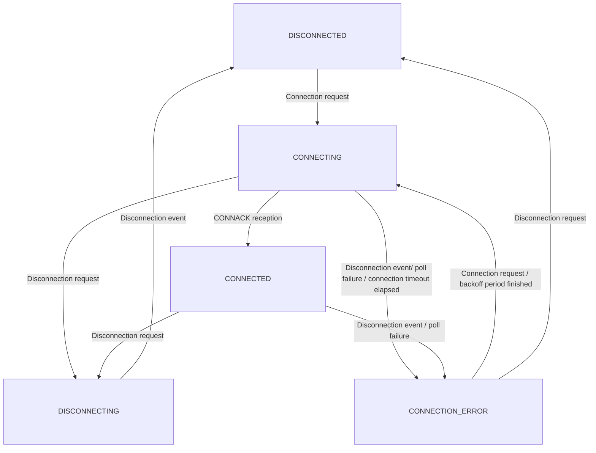

<!--
Copyright 2024 SECO Mind Srl

SPDX-License-Identifier: Apache-2.0
-->

# Astarte MQTT client

Astarte MQTT client is a soft wrapper around the MQTT client library from Zephyr. It extends the
functionality of the standard MQTT client.

## Automatic reconnection

The Astarte MQTT client implements an automatic reconnection policy in cases where connectivity
with the MQTT broker is lost.
An exponential backoff is used to limit reconnection attempts. The backoff time will start from
the user configurable polling timeout and end at the minimum between the user configurable polling
timeout and twice the keep alive time for the MQTT connection.

